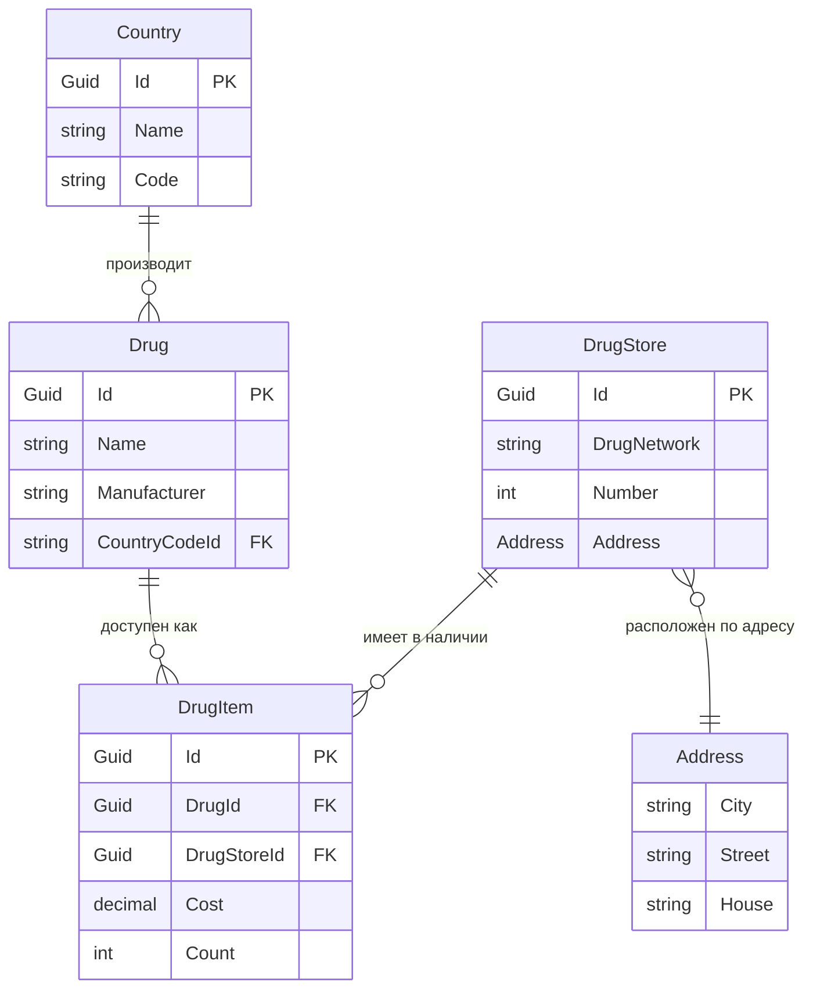

# Доменная модель для системы управления аптекой

## Обзор

Эта доменная модель представляет систему управления аптекой, включающую сущности, такие как препараты, аптеки и связи между ними. Основные сущности системы:

- **Country**: Справочник стран, каждая из которых может быть страной-производителем препаратов.
- **Drug**: Справочник доступных препаратов, связанных со страной производства.
- **DrugStore**: Справочник аптек с физическими адресами.
- **DrugItem**: Представляет конкретный препарат, доступный в конкретной аптеке, включая информацию о его стоимости и наличии.
- **Address**: Объект значения, представляющий адрес аптеки.

## Доменная диаграмма

В следующей диаграмме показаны связи между сущностями доменной области.

