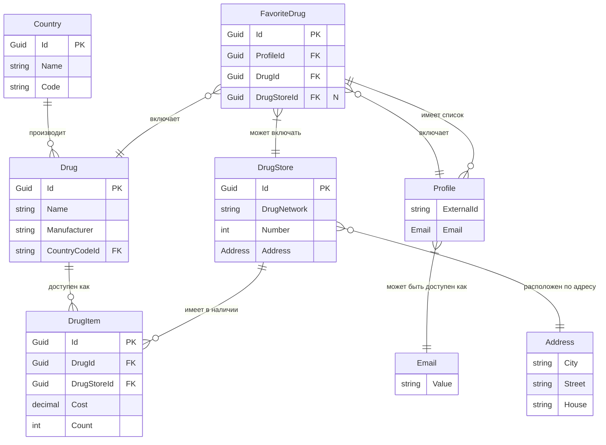

# Доменная модель для системы управления аптекой

## Обзор

Эта доменная модель представляет систему управления аптекой, включающую сущности, такие как препараты, аптеки и связи между ними. Основные сущности системы:

- **Country**: Справочник стран, каждая из которых может быть страной-производителем препаратов.
- **Drug**: Справочник доступных препаратов, связанных со страной производства.
- **DrugStore**: Справочник аптек с физическими адресами.
- **DrugItem**: Представляет конкретный препарат, доступный в конкретной аптеке, включая информацию о его стоимости и наличии.
- **Address**: Объект значения, представляющий адрес аптеки.
- **FavoriteDrug**: Представляет список избранных препаратов.
- **Profile**: Представляет список профилей, связанных с Telegram.
- **Email**: Объект значения, представляющий электронную почту профиля.

## Доменная диаграмма

В следующей диаграмме показаны связи между сущностями доменной области.

## 📝 Описание правил валидации сущностей

### 🏳️ Сущность `Country` (Страна)

- **Name**
    - Обязательное поле.
    - Длина: от 2 до 100 символов.
    - Только буквы и пробелы.
- **Code**
    - Обязательное поле.
    - Длина: ровно 2 символа.
    - Только заглавные латинские буквы.

---

### 💊 Сущность `Drug` (Лекарство)

- **Name**
    - Обязательное поле.
    - Длина: от 2 до 150 символов.
    - Без специальных символов (только буквы, цифры и пробелы).
- **Manufacturer**
    - Обязательное поле.
    - Длина: от 2 до 100 символов.
    - Только буквы, пробелы и дефисы.
- **CountryCodeId**
    - Обязательное поле.
    - Длина: ровно 2 символа.
    - Только заглавные латинские буквы.
    - Должен существовать в справочнике стран.

---

### 📦 Сущность `DrugItem` (Позиция лекарства)

- **Cost**
    - Обязательное поле.
    - Положительное число.
    - Не более двух знаков после запятой.
- **Count**
    - Обязательное поле.
    - Целое неотрицательное число.
    - Максимум: 10 000.

---

### 🏥 Сущность `DrugStore` (Аптека)

- **DrugNetwork**
    - Обязательное поле.
    - Длина: от 2 до 100 символов.
- **Number**
    - Обязательное поле.
    - Положительное целое число.
    - Уникально в пределах сети аптек.
- **Address**
    - Обязательное поле.
    - **City**
        - Длина: от 2 до 50 символов.
        - Только буквы, пробелы и дефисы.
    - **Street**
        - Длина: от 3 до 100 символов.
        - Только буквы, цифры, пробелы и дефисы.
    - **House**
        - Длина: от 1 до 10 символов.
        - Только буквы, цифры и дефисы.
    - **CountryCode**
        - Длина: ровно 2 символа.
        - Только заглавные латинские буквы.
        - Должен соответствовать существующему ISO-коду страны.
